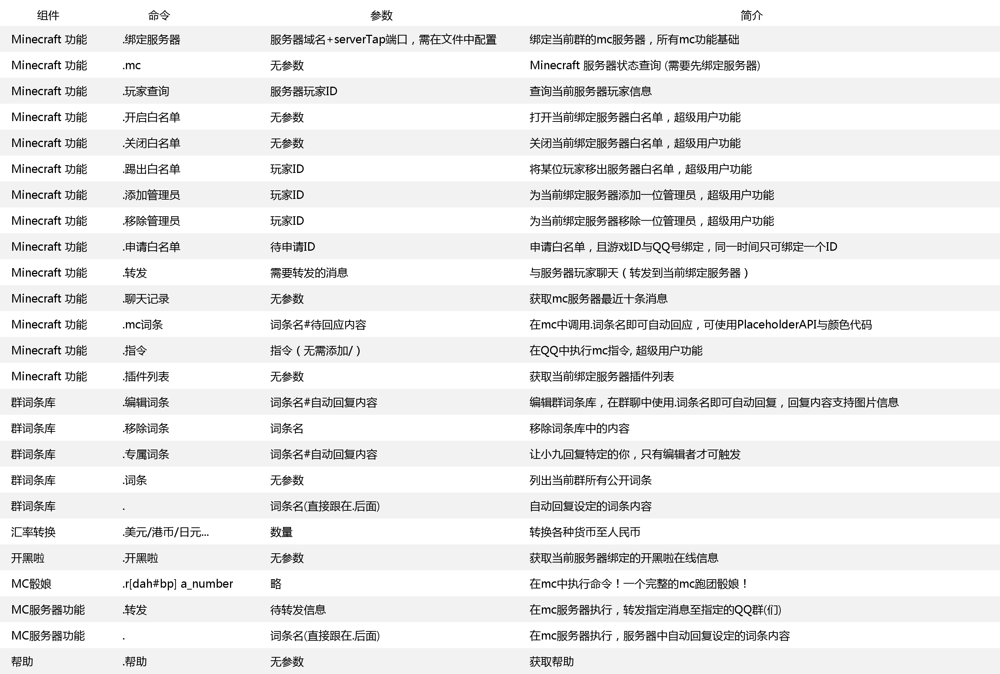
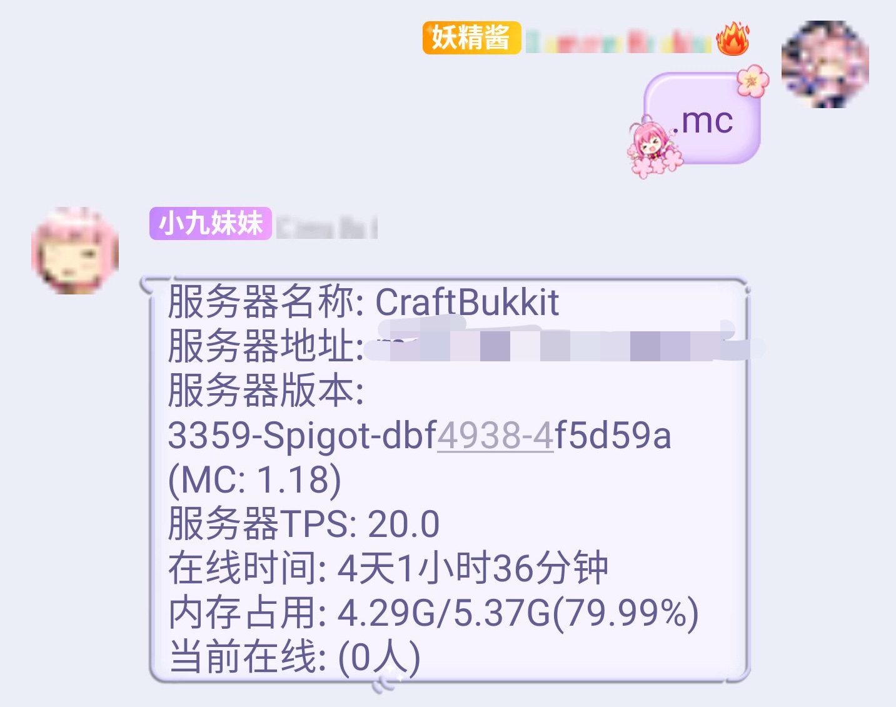
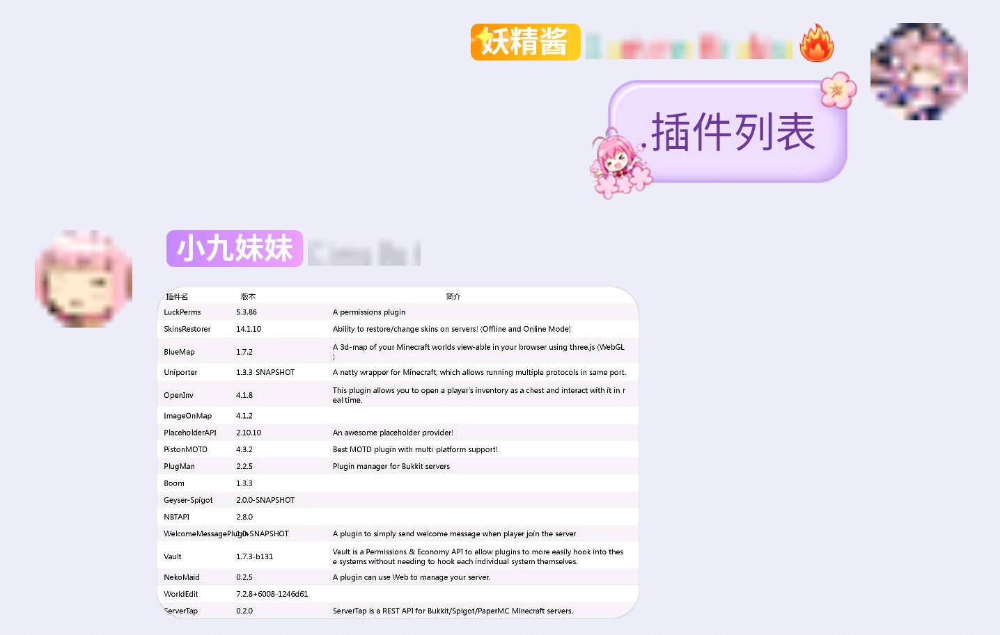

<div align=center>
  
  <h1 align="center">CirnoBot</h1> 
</div>
<div align=center>
  
  
  
  
</div>
<div align=center>
  <a href="https://biaoju.site/cirnobot/">文档</a>
  <a href="https://biaoju.site/cirnobot/docs/%E7%AE%80%E5%8D%95%E4%B8%8A%E6%89%8B">运行</a>
</div>

### 琪露诺Bot

---
专注Minecraft (加亿点点娱乐实用功能）的QQ机器人，基于nonebot2, gocqhttp, serverTap开发的琪露诺家族的第三代成员。

### 实现功能

---
+ Minecraft相关
  + [x] 服务端版本支持Bukkit, Spigot&PaperMC 1.12-1.18.1
  + [x] 多服务器同时监听支持
  + [x] 分群服务器绑定支持
  + [x] 分服务器超级用户支持
  + [x] 入服/离服事件QQ群播报
  + [x] 入服/离服事件MC服务器播报
  + [x] 广播消息均可自定义
  + [x] 支持广播消息多群发送
  + [x] 玩家聊天消息监听，支持自定词条自动回复（mc骰娘已移植）
  + [x] 所有广播/私聊消息均可支持颜色代码与PlaceholderAPI
  + [x] MC服务器在线信息查询（内存占用，版本，在线玩家）
  + [x] 获取服务器启用插件列表
  + [x] 在线/离线玩家信息查询
  + [x] 开启/关闭服务器白名单
  + [x] 添加/移除服务器管理员
  + [x] MC玩家ID绑定QQ号
  + [x] 群成员自助申请白名单
  + [x] 服务器向QQ群 / QQ群向服务器转发消息
  + [x] 查询服务器最近10条玩家消息
  + [x] 在QQ群执行MC指令
  + [x] MC词条库
+ 其他功能&特性
  + [x] 支持图片文本的群词条库支持(图片缓存到本地)
  + [x] 在群聊中动态编辑词条
  + [x] 支持群成员专属词条
  + [x] 分群启用不同的词条库
  + [x] 词条库由sqlite存储，无需开启mysql服务
  + [x] 美元/港币/日元...阿联酋迪拉姆... 货币转换支持
  + [x] 开黑啦在线成员/语音频道查询支持
  + [x] 完整的功能帮助



<p align="center">群内可使用指令</p>

### 实现截图

---
<details>
<summary>部分截图</summary>





</details>

### 简单部署

---
1.下载CirnoBot本体
```shell
git clone https://github.com/summerkirakira/CirnoBot.git # 下载CirnoBot文件
```
2.安装CirnoBot依赖(**强烈建议**使用你喜欢的 Python 环境管理工具创建新的虚拟环境)
```shell
cd CirnoBot # 进入文件夹

pip install pip --upgrade # 更新pip

pip install -r requirements.txt # 安装python依赖
```
3. 启动CirnoBot！
```shell
nb run # 启动bot！
```

### 详细配置
请参考[文档](https://biaoju.site/cirnobot/)

### To do
- [ ] docker
- [ ] web端 (永远不会做X)